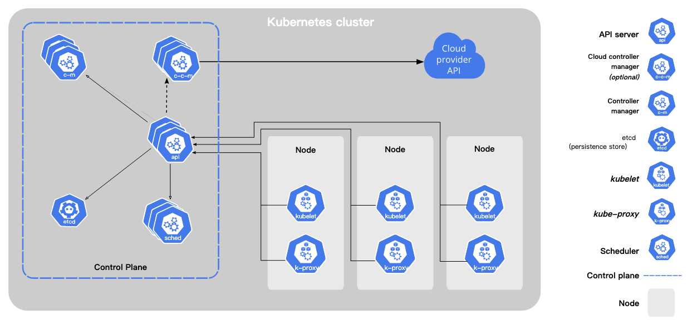
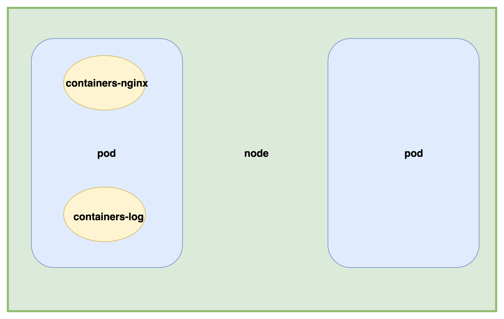
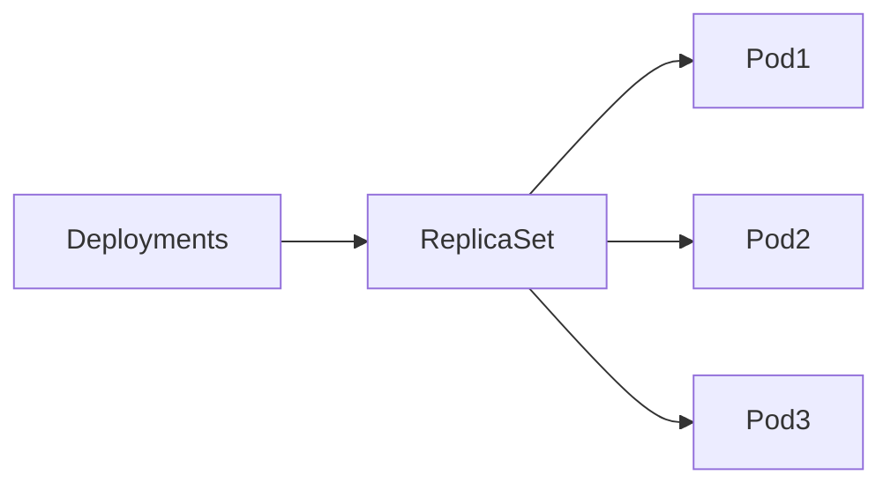
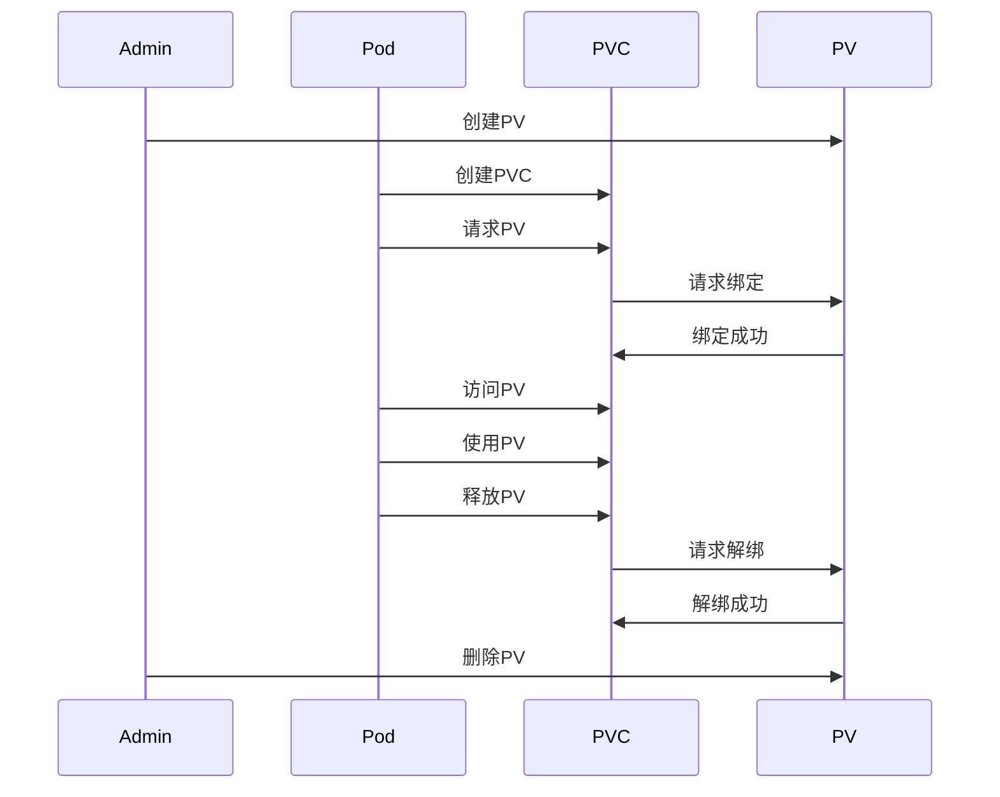

# Kubernetes基础

## 架构



### 控制平面 Control Plane

控制平面组件会为集群做出全局决策，比如资源的调度。 以及检测和响应集群事件，例如当不满足部署的 replicas 字段时， 要启动新的
pod）。

#### kube-apiserver

API 服务器是 Kubernetes 控制平面的组件， 该组件负责公开了 Kubernetes API，负责处理接受请求的工作。 API 服务器是
Kubernetes 控制平面的前端。

- 端口 8080
- 端口 6443

#### [etcd](https://etcd.io/docs/)

一致且高可用的**键值存储**，用作 Kubernetes 所有集群数据的后台数据库。

#### kube-scheduler

kube-scheduler 是控制平面的组件， 负责监视新创建的、未指定运行节点（node）的 Pods， 并选择节点来让 Pod 在上面运行。

#### kube-controller-manager

kube-controller-manager 是控制平面的组件， 负责运行控制器进程。

从逻辑上讲， 每个控制器都是一个单独的进程， 但是为了降低复杂性，它们都被编译到同一个可执行文件，并在同一个进程中运行。

这些控制器包括：

- 节点控制器（Node Controller）：负责在节点出现故障时进行通知和响应
- 任务控制器（Job Controller）：监测代表一次性任务的 Job 对象，然后创建 Pods 来运行这些任务直至完成
- 端点分片控制器（EndpointSlice controller）：填充端点分片（EndpointSlice）对象（以提供 Service 和 Pod 之间的链接）。
- 服务账号控制器（ServiceAccount controller）：为新的命名空间创建默认的服务账号（ServiceAccount）。

#### cloud-controller-manager

一个 Kubernetes 控制平面组件， 嵌入了特定于云平台的控制逻辑。cloud-controller-manager 仅运行特定于云平台的控制器。
因此如果你在自己的环境中运行 Kubernetes，或者在本地计算机中运行学习环境， 所部署的集群**不需要有云控制器管理器**。

### node 组件

节点组件会在**每个节点**上运行，负责维护运行的 Pod 并提供 Kubernetes 运行环境。

#### kubelet 服务

kubelet 会在集群中每个节点（node）上运行。 它保证容器（containers）都运行在 Pod 中。

#### kube-proxy

kube-proxy 是集群中每个节点（node）上所运行的网络代理， 实现 Kubernetes 服务（Service） 概念的一部分。

#### 容器运行时（Container Runtime）

容器运行环境是负责运行容器的软件。</br>
Kubernetes 支持许多容器运行环境，例如 containerd、 CRI-O 以及 Kubernetes CRI (容器运行环境接口) 的其他任何实现。

#### 插件（Addons）

##### DNS-几乎必须

尽管其他插件都并非严格意义上的必需组件，但几乎所有 Kubernetes 集群都应该有集群 DNS， 因为很多示例都需要 DNS 服务。

##### 仪表盘-拓展性

默认情况下**不会部署** Dashboard。可以通过以下命令部署：

```shell
kubectl apply -f https://raw.githubusercontent.com/kubernetes/dashboard/v2.7.0/aio/deploy/recommended.yaml

```

##### 资源监控-拓展性

容器资源监控 将关于容器的一些常见的时间序列度量值保存到一个集中的数据库中， 并提供浏览这些数据的界面。

例如 [Prometheus](https://github.com/prometheus/prometheus)

##### 日志收集-拓展性

集群层面日志机制负责将容器的日志数据保存到一个集中的日志存储中， 这种集中日志存储提供搜索和浏览接口。

例如 [fluentd](https://github.com/fluent/fluentd)

## node pod containers



### [nodes](https://kubernetes.io/zh-cn/docs/concepts/architecture/nodes/)

节点可以是一个虚拟机或者物理机器，取决于所在的集群配置。每个节点包含运行 Pod 所需的服务；
这些节点由[控制面](https://github.com/liubin95/docker-and-docker-compose/blob/6b5348647e7e2f108c9e8901c6ef34037f35a44a/k8s/%E5%9F%BA%E7%A1%80.md#L9)
负责管理。

### [pod](https://kubernetes.io/zh-cn/docs/concepts/workloads/pods/)

Pod 是可以在 Kubernetes 中创建和管理的、最小的可部署的计算单元。
Pod 是一组容器；这些容器共享存储、网络、以及怎样运行这些容器的声明。

### [containers](https://kubernetes.io/zh-cn/docs/concepts/containers/)

每个运行的容器都是可重复的； 包含依赖环境在内的标准，意味着无论你在哪里运行它都会得到相同的行为。

## service

## [控制器 controllers](https://kubernetes.io/zh-cn/docs/concepts/workloads/controllers/)

### Deployments

一个 Deployment 为 Pod 和 ReplicaSet 提供声明式的更新能力。

### ReplicaSet

ReplicaSet 的目的是维护一组在任何时候都处于运行状态的 Pod 副本的稳定集合。 因此，它通常用来保证给定数量的、完全相同的 Pod
的可用性。

### Deployments 和 ReplicaSet

> 说明：
> 不要管理 Deployment 所拥有的 ReplicaSet 。 如果存在下面未覆盖的使用场景，请考虑在 Kubernetes 仓库中提出 Issue。



### StatefulSet

StatefulSet 是用来管理**有状态应用**的工作负载 API 对象。

### DaemonSet

DaemonSet 确保全部（或者某些）节点上运行一个 Pod 的副本。 当有节点加入集群时， 也会为他们新增一个 Pod 。 当有节点从集群移除时，这些
Pod 也会被回收。删除 DaemonSet 将会删除它创建的所有 Pod。

DaemonSet 的一些典型用法：

- 在每个节点上运行集群**守护进程**
- 在每个节点上运行日志收集**守护进程**
- 在每个节点上运行监控**守护进程**

### Job CronJob

用于管理短期任务（Job）和定期任务（CronJob）。Job确保在集群中运行指定数量的Pod，直到它们成功完成为止。CronJob允许您定期运行Job。

## [storage](https://kubernetes.io/zh-cn/docs/concepts/storage/)

Container 中的文件在磁盘上是临时存放的，这给 Container 中运行的较重要的应用程序带来一些问题。 问题之一是当容器崩溃时文件丢失。
kubelet 会重新启动容器，但容器会以干净的状态重启。 第二个问题会在同一 Pod 中运行多个容器并共享文件时出现。
Kubernetes卷（Volume） 这一抽象概念能够解决这两个问题。

### 临时卷 Ephemeral Volume

临时卷类型的生命周期与 Pod 相同， 当 Pod 不再存在时，Kubernetes 也会销毁临时卷；

#### 临时卷类型

Kubernetes 为了不同的用途，支持几种不同类型的临时卷：

- emptyDir： Pod 启动时为空，存储空间来自本地的 kubelet 根目录（通常是根磁盘）或内存
- configMap、 downwardAPI、 secret： 将不同类型的 Kubernetes 数据注入到 Pod 中
- CSI 临时卷： 类似于前面的卷类型，但由专门支持此特性 的指定 CSI 驱动程序提供
- 通用临时卷： 它可以由所有支持持久卷的存储驱动程序提供

emptyDir、configMap、downwardAPI、secret 是作为 本地临时存储 提供的。它们由各个节点上的 kubelet 管理。

### 持久卷

持久卷可以比 Pod 的存活期长。Kubernetes 不会销毁持久卷。 对于给定 Pod 中任何类型的卷，在容器重启期间数据都不会丢失。

#### 持久卷（PersistentVolume，PV）

集群中的一块存储，可以由管理员事先制备， 或者使用存储类（Storage Class）来动态制备。 持久卷是集群资源，就像节点也是集群资源一样。PV
持久卷和普通的 Volume 一样， 也是使用卷插件来实现的，只是它们拥有独立于任何使用 PV 的 Pod 的生命周期。

#### 持久卷申领（PersistentVolumeClaim，PVC）

是用户对存储的请求。概念上与 Pod 类似。 Pod 会耗用节点资源，而 PVC 申领会耗用 PV 资源。Pod 可以请求特定数量的资源（CPU
和内存）；同样 PVC 申领也可以请求特定的大小和访问模式 （例如，可以要求 PV 卷能够以 ReadWriteOnce、ReadOnlyMany 或
ReadWriteMany 模式之一来挂载，参见访问模式）。

#### pv 和 pvc 关系

它们之间的关系是PV必须先被创建，然后才能被PVC请求使用，并且PVC请求的PersistentVolume必须与PVC的存储需求相匹配。



#### [持久卷类型](https://kubernetes.io/zh-cn/docs/concepts/storage/persistent-volumes/#types-of-persistent-volumes)

PV 持久卷是用插件的形式来实现的。Kubernetes 目前支持以下插件：

- cephfs - CephFS volume
- csi - 容器存储接口 (CSI)
- fc - Fibre Channel (FC) 存储
- hostPath - HostPath 卷 （仅供单节点测试使用；不适用于多节点集群；请尝试使用 local 卷作为替代）
- iscsi - iSCSI (SCSI over IP) 存储
- local - 节点上挂载的本地存储设备
- nfs - 网络文件系统 (NFS) 存储
- rbd - Rados 块设备 (RBD) 卷

#### 访问模式 accessModes

- ReadWriteOnce RWO
  卷可以被一个节点以读写方式挂载。 ReadWriteOnce 访问模式也允许运行在同一节点上的多个 Pod 访问卷。
- ReadOnlyMany ROX
  卷可以被多个节点以只读方式挂载。
- ReadWriteMany RWX
  卷可以被多个节点以读写方式挂载。
- ReadWriteOncePod RWOP
  卷可以被单个 Pod 以读写方式挂载。 如果你想确保整个集群中只有一个 Pod 可以读取或写入该 PVC， 请使用 ReadWriteOncePod
  访问模式。这只支持 CSI 卷以及需要 Kubernetes 1.22 以上版本。

#### 卷模式 volumeMode

- Filesystem（文件系统） 默认值。
- Block（块）

#### 回收策略 persistentVolumeReclaimPolicy

目前的回收策略有：

- Retain -- 手动回收
- Recycle -- 基本擦除 (rm -rf /thevolume/*)
- Delete -- 诸如 AWS EBS、GCE PD、Azure Disk 或 OpenStack Cinder 卷这类关联存储资产也被删除

目前，仅 NFS 和 HostPath 支持回收（Recycle）。 AWS EBS、GCE PD、Azure Disk 和 Cinder 卷都支持删除（Delete）。

#### [类 storageClassName](https://kubernetes.io/zh-cn/docs/concepts/storage/storage-classes/)

用于定义动态存储策略的模板，它可以根据PVC的需求动态创建PV。它类似于其他系统中的存储池（Storage Pool）或存储组（Storage
Group），用于管理存储资源的分配和调度。

### [投射卷（Projected Volumes）](https://kubernetes.io/zh-cn/docs/concepts/storage/projected-volumes/)

#### 类型

目前，以下类型的卷源可以被投射：

- secret
- downwardAPI
- [configMap](https://kubernetes.io/zh-cn/docs/tasks/configure-pod-container/configure-pod-configmap/)
- serviceAccountToken

所有的卷源都要求处于 Pod 所在的同一个名字空间内。更多详细信息， 可参考一体化卷设计文档。
