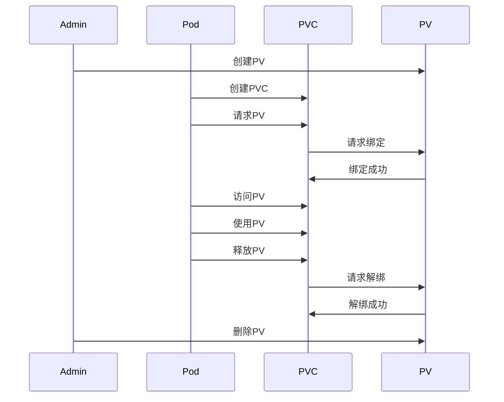

# [storage](https://kubernetes.io/zh-cn/docs/concepts/storage/)

Container 中的文件在磁盘上是临时存放的，这给 Container 中运行的较重要的应用程序带来一些问题。 问题之一是当容器崩溃时文件丢失。
kubelet 会重新启动容器，但容器会以干净的状态重启。 第二个问题会在同一 Pod 中运行多个容器并共享文件时出现。
Kubernetes卷（Volume） 这一抽象概念能够解决这两个问题。

## 临时卷 Ephemeral Volume

临时卷类型的生命周期与 Pod 相同， 当 Pod 不再存在时，Kubernetes 也会销毁临时卷；

### 临时卷类型

Kubernetes 为了不同的用途，支持几种不同类型的临时卷：

- emptyDir： Pod 启动时为空，存储空间来自本地的 kubelet 根目录（通常是根磁盘）或内存
- configMap、 downwardAPI、 secret： 将不同类型的 Kubernetes 数据注入到 Pod 中
- CSI 临时卷： 类似于前面的卷类型，但由专门支持此特性 的指定 CSI 驱动程序提供
- 通用临时卷： 它可以由所有支持持久卷的存储驱动程序提供

emptyDir、configMap、downwardAPI、secret 是作为 本地临时存储 提供的。它们由各个节点上的 kubelet 管理。

## 持久卷

持久卷可以比 Pod 的存活期长。Kubernetes 不会销毁持久卷。 对于给定 Pod 中任何类型的卷，在容器重启期间数据都不会丢失。

### 持久卷（PersistentVolume，PV）

集群中的一块存储，可以由管理员事先制备， 或者使用存储类（Storage Class）来动态制备。 持久卷是集群资源，就像节点也是集群资源一样。PV
持久卷和普通的 Volume 一样， 也是使用卷插件来实现的，只是它们拥有独立于任何使用 PV 的 Pod 的生命周期。

### 持久卷申领（PersistentVolumeClaim，PVC）

是用户对存储的请求。概念上与 Pod 类似。 Pod 会耗用节点资源，而 PVC 申领会耗用 PV 资源。Pod 可以请求特定数量的资源（CPU
和内存）；同样 PVC 申领也可以请求特定的大小和访问模式 （例如，可以要求 PV 卷能够以 ReadWriteOnce、ReadOnlyMany 或
ReadWriteMany 模式之一来挂载，参见访问模式）。

### pv 和 pvc 关系

它们之间的关系是PV必须先被创建，然后才能被PVC请求使用，并且PVC请求的PersistentVolume必须与PVC的存储需求相匹配。

### [持久卷类型](https://kubernetes.io/zh-cn/docs/concepts/storage/persistent-volumes/#types-of-persistent-volumes)

PV 持久卷是用插件的形式来实现的。Kubernetes 目前支持以下插件：

- cephfs - CephFS volume
- csi - 容器存储接口 (CSI)
- fc - Fibre Channel (FC) 存储
- hostPath - HostPath 卷 （仅供单节点测试使用；不适用于多节点集群；请尝试使用 local 卷作为替代）
- iscsi - iSCSI (SCSI over IP) 存储
- local - 节点上挂载的本地存储设备
- nfs - 网络文件系统 (NFS) 存储
- rbd - Rados 块设备 (RBD) 卷

### 访问模式 accessModes

- ReadWriteOnce RWO
  卷可以被一个节点以读写方式挂载。 ReadWriteOnce 访问模式也允许运行在同一节点上的多个 Pod 访问卷。
- ReadOnlyMany ROX
  卷可以被多个节点以只读方式挂载。
- ReadWriteMany RWX
  卷可以被多个节点以读写方式挂载。
- ReadWriteOncePod RWOP
  卷可以被单个 Pod 以读写方式挂载。 如果你想确保整个集群中只有一个 Pod 可以读取或写入该 PVC， 请使用 ReadWriteOncePod
  访问模式。这只支持 CSI 卷以及需要 Kubernetes 1.22 以上版本。

### 卷模式 volumeMode

- Filesystem（文件系统） 默认值。
- Block（块）

### 回收策略 persistentVolumeReclaimPolicy

目前的回收策略有：

- Retain -- 手动回收
- Recycle -- 基本擦除 (rm -rf /thevolume/*)
- Delete -- 诸如 AWS EBS、GCE PD、Azure Disk 或 OpenStack Cinder 卷这类关联存储资产也被删除

目前，仅 NFS 和 HostPath 支持回收（Recycle）。 AWS EBS、GCE PD、Azure Disk 和 Cinder 卷都支持删除（Delete）。

### [类 storageClassName](https://kubernetes.io/zh-cn/docs/concepts/storage/storage-classes/)

用于定义动态存储策略的模板，它可以根据PVC的需求动态创建PV。它类似于其他系统中的存储池（Storage Pool）或存储组（Storage
Group），用于管理存储资源的分配和调度。

## [投射卷（Projected Volumes）](https://kubernetes.io/zh-cn/docs/concepts/storage/projected-volumes/)

### 类型

目前，以下类型的卷源可以被投射：

- secret
- downwardAPI
- [configMap](https://kubernetes.io/zh-cn/docs/tasks/configure-pod-container/configure-pod-configmap/)
- serviceAccountToken

所有的卷源都要求处于 Pod 所在的同一个名字空间内。更多详细信息， 可参考一体化卷设计文档。
