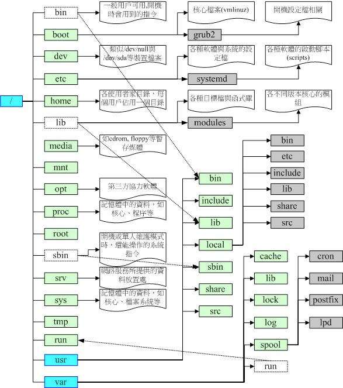
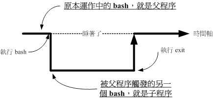
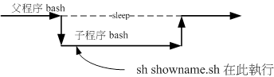
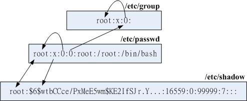
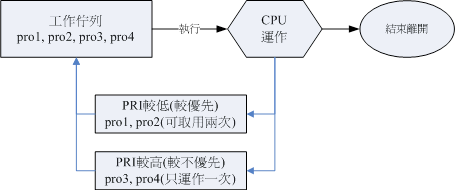

# Linux

## 常用软件

- Blue man Bluetooth Manager `sudo apt install blueman`
- [vlc video player](https://www.videolan.org/vlc/download-ubuntu.html)

## cpu

### 限定任务cpu使用率

- 避免某些任务把资源消耗完
- [使用 nice、cpulimit 和 cgroups 限制 cpu 占用率](https://www.linuxidc.com/Linux/2015-01/112382.htm)

#### 临时任务

- 使用 nice 命令手动降低任务的优先级

> 下来介绍一下nice命令的使用方法，nice命令可以修改进程的优先级，这样就可以让进程运行得不那么频繁。
> 这个功能在运行cpu密集型的后台进程或批处理作业时尤为有用。
> nice值的取值范围是[-20,19],-20表示最高优先级，而19表示最低优先级。
> Linux进程的默认nice值为0。使用nice命令（不带任何参数时）可以将进程的nice值设置为10。
> 这样调度器就会将此进程视为较低优先级的进程，从而减少cpu资源的分配。

```shell
# 压缩文件时，控制cpu使用量
nice zip a.zip a.sql
# 把pid 6919 的进程优先级降低
renice +10 6919
```

#### 长久任务

- cgroups 命令集
- [Linux资源管理之cgroups简介](https://tech.meituan.com/2015/03/31/cgroups.html)

> 功能最为强大地控制组（cgroups）的用法。
> cgroups 是 Linux 内核提供的一种机制，利用它可以指定一组进程的资源分配。
> 具体来说，使用 cgroups，用户能够限定一组进程的 cpu 占用率、系统内存消耗、网络带宽，以及这几种资源的组合。
> cgroups 的优势在于它可以控制一组进程，不像前者仅能控制单进程。而 cgroups 则可以限制其他进程资源的使用。
> 就拿 CoreOS 作为例子，这是一个专为大规模服务器部署而设计的最简化的 Linux 发行版本，它的 upgrade 进程就是使用 cgroups 来管控。这样，系统在下载和安装升级版本时也不会影响到系统的性能。

```shell
sudo cgcreate -g cpu:/cpulimited
sudo cgcreate -g cpu:/lesscpulimited
```

## 内存

```shell
# show ram info
free -ht
```

|        | total | used  | free  | shared | buff/cache | available |
|--------|-------|-------|-------|--------|------------|-----------|
| Mem:   | 7.8Gi | 1.0Gi | 6.1Gi | 366Mi  | 624Mi      | 6.2Gi     |
| Swap:  | 2.0Gi | 2.0Mi | 2.0Gi |        |            |           |
| Total: | 9.8Gi | 1.0Gi | 8.1Gi |        |            |           |

```shell
# clear cache
echo 3 > /proc/sys/vm/drop_caches
```

> To free page cache:<br>
> echo 1 > /proc/sys/vm/drop_caches<br>
> To free reclaimable slab objects (includes dentries and inodes):<br>
> echo 2 > /proc/sys/vm/drop_caches<br>
> To free slab objects and page cache:<br>
> echo 3 > /proc/sys/vm/drop_caches

## 文件和文件夹

### Linux 常用 文件夹

| 文件夹        | 用途                                                                                                | 备注                            |
|------------|---------------------------------------------------------------------------------------------------|-------------------------------|
| /          | 根目录，保持越小越好，效率高，问题少                                                                                |                               |
| /bin       | 可执行文件，维护模式下可以使用的基础命令（所有用户）                                                                        | centos 已将文件移入/usr/bin。这里是链接   |
| /boot      | 开机引导。                                                                                             |                               |
| /dev       | 设备都会以文件的形式存在。/dev/sda 第一块磁盘 等等                                                                    | /dev/null 空设备                 |
| /etc       | 所有的配置文件，包括系统，和其他服务。                                                                               |                               |
| /etc/opt   | 保存opt下第三方软件的配置文件                                                                                  |                               |
| /lib       | 开机时用到的类库                                                                                          | 同/bin，已移入 /usr/lib            |
| /mnt       | 暂时挂载的设备                                                                                           |                               |
| /opt       | 第三方软件                                                                                             |                               |
| /sbin      | 可执行文件，维护模式下可以使用的基础命令（root用户）                                                                      | 同/bin，已移入 /usr/sbin           |
| /tmp       | 临时文件                                                                                              |                               |
| /usr       | 系统预设软件。因此这个目录有点类似Windows 系统的『C:\Windows\ (当中的一部份) + C:\Program files\』这两个目录的综合体                   | usr是Unix Software Resource的缩写 |
| /usr/bin   | 一般用户使用的指令                                                                                         | FHS 要求在此目录下不应该有子目录            |
| /usr/local | 自行更新的预装软件。保留原来的，新的放置此处                                                                            |                               |
| /var       | 系统运行是变动的文件。包括缓存(cache)、登录档(log file)以及某些软件运作所产生的文件， 包括程序档案(lock file, run file)，或者例如MySQL资料库的文件等等 |                               |
| /home      | 用户的home，                                                                                          | cd ~ = cd                     |
| /lib*      | /lib 不同的格式的二进位函式库，例如 /lib64 64位函数库                                                                |                               |
| /root      | root用户的home                                                                                       |                               |

> CentOS 7 在目录的编排上与过去的版本不同。比较大的差异在于将许多原本应该要在根目录(/) 里面的目录，将他内部资料全部挪到/usr 里面去，然后进行连结设定！包括底下这些：
>
>- /bin --> /usr/bin
>- /sbin --> /usr/sbin
>- /lib --> /usr/lib
>- /lib64 --> /usr/lib64
>- /var/lock --> /run/lock
>- /var/run --> /run



## 正则和文件处理

### 正则表达式

[在线工具](https://c.runoob.com/front-end/854/)

### sed

```shell
# 选项与参数：
# -n ：使用安静(silent)模式。在一般sed 的用法中，所有来自STDIN 的资料一般都会被列出到萤幕上。
      # 但如果加上-n 参数后，则只有经过sed 特殊处理的那一行(或者动作)才会被列出来。
# -e ：直接在指令列模式上进行sed 的动作编辑；
# -f ：直接将sed 的动作写在一个档案内， -f filename 则可以执行filename 内的sed 动作；
# -r ：sed 的动作支援的是延伸型正规表示法的语法。(预设是基础正规表示法语法)
# -i ：直接修改读取的档案内容，而不是由萤幕输出。

# 动作说明： [n1[,n2]]function
# n1, n2 ：不见得会存在，一般代表『选择进行动作的行数』，举例来说，如果我的动作
         # 是需要在10 到20 行之间进行的，则『 10,20[动作行为] 』

# function 有底下这些咚咚：
# a ：新增， a 的后面可以接字串，而这些字串会在新的一行出现(目前的下一行)～
# c ：取代， c 的后面可以接字串，这些字串可以取代n1,n2 之间的行！
# d ：删除，因为是删除啊，所以d 后面通常不接任何咚咚；
# i ：插入， i 的后面可以接字串，而这些字串会在新的一行出现(目前的上一行)；
# p ：列印，亦即将某个选择的资料印出。通常p 会与参数sed -n 一起运作～
# s ：取代，可以直接进行取代的工作哩！通常这个s 的动作可以搭配正规表示法！
      # 例如1,20s/old/new/g 就是啦！
# 删除2-5行
sed '2,5d' /etc/hosts
# 最后一行 $
sed '$d' /etc/hosts
# 取代2-5行
sed '2,5c\new line' /etc/hosts
# 显示2-5行
sed -n '2,5p' /etc/hosts
# 新增一行
sed '2a\new line' /etc/hosts
# 新增多行
sed '2a\new line1 \
new line2' /etc/hosts
# sed 's/要被取代的字串/新的字串/g'
sed 's/old/new/g' /etc/hosts
ifconfig | grep 'inet 192' | sed 's/netmask.*$//g'|sed 's/inet//g'      
# 多个操作
sed -e '4d' -e '6c no six line' /etc/hosts
# 修改并备份文件
sed -i.bak 's/hello/nihao/g' hello

```

### printf

```shell
#选项与参数：
#关于格式方面的几个特殊样式：
#       \a 警告声音输出
#       \b 倒退键(backspace)
#       \f 清除萤幕(form feed)
#       \n 输出新的一行
#       \r 亦即Enter 按键
#       \t 水平的[tab] 按键
#       \v 垂直的[tab] 按键
#       \xNN NN 为两位数的数字，可以转换数字成为字元。
#关于C 程式语言内，常见的变数格式
#       %ns 那个n 是数字， s 代表string ，亦即多少个字元；
#       %ni 那个n 是数字， i 代表integer ，亦即多少整数位数；
#       %N.nf 那个n 与N 都是数字， f 代表floating (浮点)，如果有小数位数，
#             假设我共要十个位数，但小数点有两位，即为%10.2f 啰！
printf '%10s %5i %5i %5i %8.2f \n' $(cat printf.txt | grep -v Name)
# 上面的格式共分为五个栏位，
# %10s 代表的是一个长度为10 个字元的字串栏位，
# %5i 代表的是长度为5 个字元的数字栏位，
# 至于那个%8.2f 则代表长度为8 个字元的具有小数点的栏位，其中小数点有两个字元宽度。
```

### awk

```shell
# awk 主要是处理『每一行的栏位内的资料』，而预设的『栏位的分隔符号为 "空白键" 或"[tab]键" 』！
# awk '条件类型1{动作1} 条件类型2{动作2} ...' filename
# 打印第一列 和 第三列
last -n 5 | awk '{print $1 "\t" $3}'
# 预设变量
# $0 代表整行的资料
# $1 代表第一个栏位的资料
# NF 代表栏位的总数
# NR 代表目前的行数
# FS 代表栏位分隔符号，默认是空白键与[tab]键
# 设置分隔符
awk -F: '{print $1 "\t" $3}' /etc/passwd
awk 'BEGIN{FS=":"} {print $1 "\t" $3}' /etc/passwd
# 条件判断
awk -F: '$3 > 277 {print $1 "\t" $3}' /etc/passwd
# 计算 和 变量
# Name 1st 2nd 3th
# VBird 23000 24000 25000
# DMTsai 21000 20000 23000
# Bird2 43000 42000 41000
# awk 的指令间隔：所有awk 的动作，亦即在{} 内的动作，如果有需要多个指令辅助时，可利用分号『;』间隔， 或者直接以[Enter] 按键来隔开每个指令，例如上面的范例中，鸟哥共按了三次[enter] 喔！
# 与bash shell 的变数不同，在awk 当中，变数可以直接使用，不需加上$ 符号。
awk 'NR==1{print $0 " total"};NR>=2{sum =$2+$3+$4;print $0" "sum}' pay.txt
cat regular_express.txt | sed '1d' | awk '{sum=$2+$3+$4+$5;avg=sum/4;print $0" "sum" "avg}'
```

### diff

```shell
# diff file1 file2
#-b ：忽略一行当中，仅有多个空白的差异(例如"about me" 与"about me" 视为相同
#-B ：忽略空白行的差异。
#-i ：忽略大小写的不同。
diff passwd.old passwd.new 
#4d3    <==左边第四行被删除(d) 掉了，基准是右边的第三行
#< # Note that this file is consulted directly only when the system is running  <==这边列出左边(<)档案被删除的那一行内容
#6c5   <==左边第六行被改变(c) 了，基准是右边的第五行
#< # Open Directory.  <==这边列出左边(<)档案被改变的那一行内容
#---
#> new line <==这边列出右边(>)档案被改变的那一行内容
```

### patch

```shell
#『将旧的档案升级成为新的档案』时，应该要怎么做呢？其实也不难啦！就是『先比较先旧版本的差异，并将差异档制作成为补丁档，再由补丁档更新旧档案』即可。
# 选项与参数：
# -p ：后面可以接『取消几层目录』的意思。
# -R ：代表还原，将新的档案还原成原来旧的版本。
# 导出差异文件
diff -Naur regular_express.txt.old regular_express.txt > txt.patch
# 升级
patch -p0 < txt.patch
# 还原
patch -p0 -R < txt.patch
```

## 磁盘

### df

> 第1列是设备名
> 第2列是磁盘总容量大小
> 第3列是已使用容量大小
> 第4列是剩余容量大小
> 第5列容量已使用百分比
> 第6列挂载点目录名称

```shell
# show disk info
[root@dev163 _data]# df -h
Filesystem               Size  Used Avail Use% Mounted on
devtmpfs                 7.8G     0  7.8G   0% /dev
tmpfs                    7.8G     0  7.8G   0% /dev/shm
tmpfs                    7.8G  9.0M  7.8G   1% /run
tmpfs                    7.8G     0  7.8G   0% /sys/fs/cgroup
/dev/mapper/centos-root   40G   40G   44K 100% /
/dev/sda1                497M  169M  328M  34% /boot
/dev/mapper/centos-data  260G   54G  206G  21% /data
overlay                  260G   54G  206G  21% /data/lib/docker/overlay2/b4262b4b82183c389399f6ab50228384d69e5e55a487b0270ec0b47e9031f59c/merged
overlay                  260G   54G  206G  21% /data/lib/docker/overlay2/da377cff0ea3ddefa38a2500b57fe01d165bfd1f99c170a53f0d425149baa6f9/merged
tmpfs                    1.6G     0  1.6G   0% /run/user/0
```

- `tmpfs`字样的是虚拟内存文件系统(此处不做展开);
- 文件系统`/dev/mapper/centos-root`的挂载点是/(根目录)，即通常所说的根分区(或根文件系统);
- `/dev/sda1`(boot分区)中保存了内核映像和一些启动时需要的辅助文件;
- `overlay`[overlay文件系统](http://dockone.io/article/1511) 一般是 docker 容器在使用;

### du

- c或--total 除了显示个别目录或文件的大小外，同时也显示所有目录或文件的总和;
- s或--summarize 仅显示总计;
- -h或--human-readable 以K，M，G为单位，提高信息的可读性;

```shell
# show dir var disk info
du -sh /var/*
# sort
du -sh /var/* | sort -rh 
```

### 挂载磁盘

```shell
# 查看磁盘挂载情况
lsblk

# 查看磁盘详情
sudo fdisk -l

# 格式化磁盘 ext4
sudo mkfs -t ext4 /dev/sdb

# 挂载
sudo mount /dev/sdb /data

# 获取磁盘的UUID
sudo blkid /dev/sdb

# 重启自动挂载
sudo vim /etc/fstab
# 要填写file system、mount point、type、options、dump、pass等六项。
# 其中mount point为我们的挂载点/data/；type为我们格式化的文件格式，ext4；options我们一般就是defaults；
# dump都是0、pass也都是0，除非挂载点是/。
UUID=38b045ea-0bcd-46dc-b5a2-76917a91d9fe /data/ ext4 defaults 0 0
```

### 链接 ln

#### 硬连接

```shell
# 创建硬连接
ln file1 file2
# 查看硬连接数
ls -l file1
# 删除硬连接
rm file2
```

##### 限制

- 不能跨分区
- 不能针对目录

#### 软连接

```shell
# 创建软连接
ln -s file1 file2
# 目录
ln -s /bin /root/bin
# 查看软连接
ls -l file2
# 删除软连接
rm file2
```

## 网络

### 端口

```shell
# show port info
# 选项与参数：
# -a ：将目前系统上所有的连线、监听、Socket 资料都列出来
# -t ：列出tcp 网路封包的资料
# -u ：列出udp 网路封包的资料
# -n ：不以程序的服务名称，以埠号(port number) 来显示；
# -l ：列出目前正在网路监听(listen) 的服务；
# -p ：列出该网路服务的程序PID
netstat -tunlp
# netcat
# 扫描 端口范围
nc -z -v -w2 -u 127.0.0.1 1-65535
```

## shell /bash

### 种类

- Bourne Shell（/usr/bin/sh或/bin/sh）
- Bourne Again Shell（/bin/bash） 是Linux 预设的shell
- C Shell（/usr/bin/csh）
- Korn Shell（/usr/bin/ksh）
- Shell for Root（/sbin/sh）
- POSIX Shell（/bin/sh）
- Z Shell（/bin/zsh）macOS 预设的shell
- ……

### 变量

- 变量名和等号之间不能有空格

#### 变量名

- 变量名只能使用英文字母，数字和下划线，首个字符不能以数字开头
- 不能使用标点符号
- 不能使用bash里的关键字（可用help命令查看保留关键字）
- 不能使用空格赋值，变量名=变量值
- 变量名区分大小写
- 读取变量值时，变量名前面加美元符号$，如：$name
- 变量名外面的花括号是可选的，加不加都行，如：${name}或$name
- 变量名如果是复合形式，如：${name}1，花括号是必须的，如：${name}1

#### 变量值

- 变量值可以是数字、字母、字符串、特殊字符等
- 变量值可以为空。删除变量 `unset name`
- 变量值如果是复合形式，如：$name1，变量值要用双引号括起来，如："$name"1
- 变量值如果包含空格，必须用双引号括起来，如：name="my name is tom"
- 除了让**变量不解析**使用单引号，其他情况都可以使用双引号。
- 反单引号『`指令`』或 『$(指令)』
- 追加变量内容 `PATH=${PATH}:/home/bin`
- 若该变量需要在其他子程序执行，需要以export 来使变量变成环境变量

```shell
# 变量赋值
name="tom"
# 变量引用
echo $name
# 变量删除
unset name
# 空格
name="my name is tom"
# 复合形式
home="$name at home"
home="${name} at home"
# 特殊字符
name='this is a $name' # $name 不会被解析
# 双引号
name="this is a \"name\""
# 单引号
name="this is a 'name'"
# 指令
name=`date`
name=$(date)
```

#### 环境变量

> 为什么需要环境变量?</br>
> 当你登入Linux 并取得一个bash 之后，你的bash 就是一个独立的程序，这个程序的识别使用的是一个称为程序识别码，被称为PID 的就是。接下来你在这个bash 底下所下达的任何指令都是由这个bash 所衍生出来的，那些被下达的指令就被称为子程序了。</br>
> 我们在原本的bash 底下执行另一个bash ，结果操作的环境介面会跑到第二个bash 去(就是子程序)， 那原本的bash 就会在暂停的情况(睡着了，就是sleep)。整个指令运作的环境是实线的部分！若要回到原本的bash 去， 就只有将第二个bash 结束掉(下达exit 或logout) 才行。</br>
> **子程序仅会继承父程序的环境变量， 子程序不会继承父程序的自订变量啦**



- 环境变量是系统中所有用户都能访问的变量
- 环境变量一般大写
- 分享自己的变量设定给后来呼叫的档案或其他程序

```shell
# 查看环境变量
env
# 查看某个环境变量
echo $PATH
# 设置环境变量
export PATH=/home/bin:$PATH
# 删除环境变量
unset PATH
# 变量导出
export PATH
```

### 常用命令

- `echo` 显示字符串
- `read` 读取键盘输入

```shell
read -p "请输入用户名：" name
echo "你输入的用户名是：$name"
```

- `declare / typeset` 声明变量类型

```shell
# -r 只读
# -i 整数
# -a 数组
# -x 导出
declare -r name="tom"
declare -i age=18+18 # age=36
age=18+18 # age=18+18
declare -a arr=(1 2 3)
echo ${arr[0]} # 1
declare -x name="tom"
```

- `alias` 缩写

```shell
alias ll='ls -l --color=auto'
unalias ll
```

- `history` 查看历史命令

```shell
# 查看历史命令
history
# 查看历史命令并执行
!n
# 执行上一个指令
!!
# 执行上一个以xxx开头的指令
!xxx
```

- `test` 测试条件
- `expr` 运算
- `source` 读取并执行文件内容

```shell
source ~/.bashrc
. ~/.bashrc
```

### 资源限制 ulimit

```shell
# 查看资源限制
ulimit -a
# 设置资源限制
ulimit -c 1024 # core文件大小
ulimit -d 1024 # 数据段大小
ulimit -f 1024 # 文件大小
ulimit -m 1024 # 内存大小 **
ulimit -n 1024 # 打开文件数
ulimit -s 1024 # 栈大小
ulimit -t 1024 # cpu时间 **
ulimit -u 1024 # 进程数 **
ulimit -v 1024 # 虚拟内存
ulimit -x 1024 # 文件锁定数
# -S ：soft limit ，警告的设定，可以超过这个设定值，但是若超过则有警告讯息。
# -H ：hard limit ，严格的设定，必定不能超过这个设定的数值；
```

### 特殊字符

- `~` 用户主目录
- `.` 当前目录
- `..` 上级目录
- `*` 通配符 代表『 0 个到无穷多个』任意字元
- `?` 通配符 代表『一定有一个』任意字元
- `[]` 通配符 同样代表『一定有一个在括号内』的字元(非任意字元)。例如[abcd] 代表『一定有一个字元， 可能是a, b, c, d 这四个任何一个』
- `[-]` 通配符 代表『一定有一个在括号内』的字元(非任意字元)。例如[a-d] 代表『一定有一个字元， 可能是a, b, c, d 这四个任何一个』
- `[^]` 通配符 代表『一定有一个不在括号内』的字元(非任意字元)。例如[^a-d] 代表『一定有一个字元， 可能是a, b, c, d 以外的任何一个』
- `|` 管道
- `>` 重定向
- `>>` 追加重定向
- `&` 后台执行
- `#` 注释
- `\\` 转义字符
- `;` 连续指令下达分隔符号：连续性命令的界定(注意！与管线命令并不相同)
- `()` 子程序
- `{}` 组合命令

### 重定向 > >>

> 标准输出指的是『指令执行所回传的正确的讯息』standard output (简称stdout)，而标准错误输出可理解为『 指令执行失败后，所回传的错误讯息』standard error output (简称stderr) 。

1. 标准输入 stdin 代码为 0
2. 标准输出 stdout 代码为 1
3. 标准错误输出 stderr 代码为 2

```shell
# 重定向
ll > test.txt
# 追加重定向
ll >> test.txt
# 重定向错误输出
ll 2> test.txt
# 重定向标准输出和错误输出
ll -123 > ll 2> err
# 丢弃标准输出
ll > /dev/null
# 丢弃标准错误输出
ll 2> /dev/null
# 同一个文件
ll > test.txt 2>&1
ll &> test.txt
```

```shell
# 读取键盘输入
cat > test.txt
# 文件作为输入 
cat > catfile < test.txt
# eof
cat > catfile << eof
> 123
> 456
> eof
```

### 多命令执行

#### cmd;cmd

```shell
# 顺序执行
sync; sync; shutdown -h now
```

#### && ||

```shell
# && 前面的命令执行成功后才执行后面的命令
cd /home && ls
# || 前面的命令执行失败后才执行后面的命令
cd /notexit || ls
# 判断目录是否存在，不存在则创建，然后创建文件
cd /home/test || mkdir -p /home/test && touch /home/test/test.txt
```

### 管道 pipe

```shell
# find string in this directory
ls | grep string
# 排除空行
grep -v '^$' filename
# grep 正则
grep -E '^[0-9]+$' filename
# sort dir by size desc
du -sh ./*/ |sort -rh 
# show file 10-20 lines with line number
cat -n file | sed -n '10,20p'
cat -n file | head -n 20 | tail -n 10
```

#### cut

```shell
# cut -d 分隔符 -f 列数
echo $PATH | cut -d ':' -f 1,2
# cut -c 字符位置
echo $PATH | cut -c 1-5
```

#### sort

```shell
# sort -r 逆序
# sort -n 数字排序
# sort -k 列数
# sort -t 分隔符
# sort -u 去重
# sort -b 忽略前导空格
# sort -f 忽略大小写

tail -n 10 /etc/passwd | cut -d ':' -f 1,2,3  | sort -t ':' -k 3 -n -r
```

#### uniq

```shell
# uniq -c 统计重复行数
# uniq -i 忽略大小写
last | cut -d ' ' -f1 | sort | uniq -c
```

#### wc

```shell
# wc -l 行数
# wc -w 单词数
# wc -c 字符数
wc index.zsh
cat /etc/man_db.conf | wc
# 输出的三个数字中，分别代表： 『行、字数、字元数』
```

#### tee

```shell
# tee -a 追加
# tee 会同时将资料流分送到档案去与萤幕(screen)；而输出到萤幕的，其实就是stdout ，那就可以让下个指令继续处理喔！
last | tee last.list | cut -d " " -f 1 
```

#### 文字处理

- `tr` 转换或删除字符
- `join` 将两个已排序的文件按照相同的字段进行合并。**在使用join 之前，你所需要处理的档案应该要事先经过排序(sort) 处理**

```shell
# 选项与参数：
# -t ：join 预设以空白字元分隔资料，并且比对『第一个栏位』的资料，
#       如果两个档案相同，则将两笔资料联成一行，且第一个栏位放在第一个！
# -i ：忽略大小写的差异；
# -1 ：这个是数字的1 ，代表『第一个档案要用那个栏位来分析』的意思；
# -2 ：代表『第二个档案要用那个栏位来分析』的意思。
join -t ':' -1 4  -2 3 /etc/passwd /etc/group | tail -n 10
```

- `paste` 将多个文件的内容按行合并 将两行贴在一起，且中间以[tab] 键隔开
- `expand` 将制表符转换为空格
- `unexpand` 将空格转换为制表符
- `split` 将文件分割成多个小文件

```shell
# split [OPTION]... [INPUT [PREFIX]]
# 选项与参数：
# -b ：指定每个小文件的大小，单位为『块』；
# -l ：指定每个小文件的大小，单位为『行』；
split -b 300k /etc/services services # 按照300k分割
split -l 100 /etc/services services # 按照100行分割
# 合并
cat services* > /etc/services
# 使用ls -al / 输出的资讯中，每十行记录成一个档案
ls -al / | split -l 10 - ll
```

- `xargs` 将命令的输出结果作为参数传递给另一个命令

```shell
# 很多指令其实并不支援管线命令，因此我们可以透过xargs 来提供该指令引用standard input 之用！
# 选项与参数：
# -n ：指定每次传递给命令的参数个数；
# -d ：指定分隔符，默认是以『空白字元』作为分隔符；
# -p ：指定命令执行前的提示信息；
# 删除test开头的文件
ls | grep test | xargs rm -f
```

- `-` 代表标准输入

```shell
# 管道命令中代替 filename
ls -al / | split -l 10 - ll
```

### 编写shell

#### 基础语法

```shell
#!/bin/bash
echo "hello world !"
exit 0
```

```shell
#!/bin/zsh
read -p "please input your name: " name
# 变量
echo -e "\n hello $name"
# 计算
echo "13*13=$((13*13))"
exit 0
```

```shell
#!/bin/bash
read -p "filename is :" filename
# 变量默认值
filename=${filename:-"default-name"}
date=$(date +%Y%m%d)
filename=${filename}-${date}
touch ${filename}
exit 0
```

```shell
#!/bin/bash
# cpu 计算。可以模拟cpu高负载。${num} 越大时间越长
time echo "scale=${num}; 4*a(1)" | bc -lq
# bc -lq  90.32s user 0.63s system 98% cpu 1:32.68 total
exit 0
```

#### sh 和 source 的区别

```shell
#!/bin/bash
# sh 和 source 的区别
# sh 会开启一个子进程，source 不会
read -p "please input your name: " name
# sh 运行后 `echo $name` 为空
# source 运行后 `echo $name` 有值
exit 0
```

<table style="margin-left: auto; margin-right: auto;">
        <tr>
            <td>

            </td>
            <td>

            </td>
        </tr>
</table>

#### 判断

##### test

```shell
# 1. 关于某个档名的『档案类型』判断，如test -e filename 表示存在否
# -e 是否存在；-f 是否为普通文件；-d 是否为目录
test -e /etc/passwd && echo "yes" || echo "no"
# 2. 关于某个数值的『比较判断』，如test 100 -gt 99 表示『大于』否
# -eq 等于；-ne 不等于；-gt 大于；-ge 大于等于；-lt 小于；-le 小于等于
test 100 -gt 99 && echo "yes" || echo "no"
# 3. 关于某个字符串的『比较判断』，如test "abc" == "abc" 表示『相等』否
# == 等于；!= 不等于
test "abc" == "abc" && echo "yes" || echo "no"
# 4. 关于某个文件的『权限判断』，如test -r filename 表示『可读』否
# -r 是否可读；-w 是否可写；-x 是否可执行
test -r /etc/passwd && echo "yes" || echo "no"
# 5. 多重判断
# -a 与；-o 或；! 非
test -e /etc/passwd -a -r /etc/passwd && echo "yes" || echo "no"
# 6.正则表达式判断
# =~ 匹配
test "abc" =~ "a" && echo "yes" || echo "no"
```

```shell
#!/bin/bash
# 这个档案是否存在，若不存在则给予一个『Filename does not exist』的讯息，并中断程式；
# 若这个档案存在，则判断他是个档案或目录，结果输出『Filename is regular file』或 『Filename is directory』
# 判断一下，执行者的身份对这个档案或目录所拥有的权限，并输出权限资料！
read -p "input filename :" filename
test -z $filename && echo "you must input a filename." && exit 0
test ! -e $filename && echo "the filename '$filename' DO NOT exist" && exit 0
test -f $filename && filetype="regular file"
test -d $filename && filetype="directory"
test -r $filename && perm="readable"
test -w $filename && perm="$perm writable"
test -x $filename && perm="$perm executable"
echo "the filename: $filename is a $filetype perm is $perm"
```

##### []

```shell
#!/bin/bash
# 在中括号[] 内的每个元件都需要有空白键来分隔；
# 在中括号内的变数，最好都以双引号括号起来；
# 在中括号内的常数，最好都以单或双引号括号起来。


# 当执行一个程式的时候，这个程式会让使用者选择Y 或N ，
# 如果使用者输入Y 或y 时，就显示『 OK, continue 』
# 如果使用者输入n 或N 时，就显示『 Oh, interrupt ！』
# 如果不是Y/y/N/n 之内的其他字元，就显示『 I don't know what your choice is 』
read -p "please input (Y/N):" yn
[ "$yn" == "Y" -o "$yn" == "y" ] && echo "OK, continue" && exit 0
[ "$yn" == "N" -o "$yn" == "n" ] && echo "Oh,interrupt" && exit 0
echo "I don't know what your choice is"
exit 0
```

##### if

```shell
#!/bin/bash
read -p "please input (Y/N):" yn

if [ "$yn" == "Y" ] || [ "$yn" == "y" ]; then
    echo "OK, continue"
elif [ "$yn" == "N" ] || [ "$yn" == "n" ]; then
    echo "Oh,interrupt"
else 
    echo "I don't know what your choice is"
fi
exit 0
```

##### case

```shell
#!/bin/bash
# case 语句可以匹配一个值与一个模式，如果匹配成功，那么执行相匹配的命令。
read -p "please input (Y/N):" yn
case "$yn" in
[Yy]) echo "OK, continue" ;;
[Nn]) echo "Oh,interrupt" ;;
*) echo "I don't know what your choice is" ;;
esac
exit 0
```

#### 预设变量

```shell
#!/bin/bash
# /path/to/scriptname opt1 opt2 opt3 opt4
# $0 $1 $2 $3 $4
# $# 传递给脚本的参数个数 4
# $@ 传递给脚本的所有参数 "opt1" "opt2" "opt3" "opt4"
# $* "opt1 opt2 opt3 opt4" c为分隔字元，预设为空白键
echo "script name is $0"
echo "$#"
echo "$@"
echo "$*"
exit 0
```

#### function

```shell
#!/bin/bash
# function
# [function] function_name() { commands; }
# 因此在shell script 当中的function 的设定一定要在程式的最前面
# 参数 $1 $2 $3 $4 
# $0 方法名
function print_text() {
    echo -n "text is $1"
}
print_text "function_name"
exit 0
```

#### 循环

##### while/until

```shell
#!/bin/bash
# 输入yes 程序停止
#『当condition 条件成立时，就进行循环，直到condition 的条件不成立才停止』
while [ "$yn" != "yes" ]; do
    read -p "input yes to stop:" yn
done
# 『当condition 条件成立时，就终止循环， 否则就持续进行循环的程式段。』
until [ "$yn" == "yes" ]; do
    read -p "input yes to stop:" yn    
done
exit 0
```

##### for

```shell
#!/bin/bash

# 列表
for var in dog cat elephant ; do
    echo "There are ${var}s.... "
done
for file in $(ls) ; do
    echo "file is $file"
done

# 数字 或者字母
#  {a..g} 代表 a b c d e f g
sum=0
for i in {1..5} ; do
    sum=$(($sum+$i))
done
echo "sum is $sum"

# 
for (( i = 0; i < n; i++ )); do
    echo "i is $i"
done

# 读取文件
for i in $(cat /etc/passwd); do
    echo $i
done

exit 0
```

#### sh

```shell
#!/bin/bash
# sh
# sh -x scriptname # 执行脚本并打印出每一行的命令 debug
# sh -n scriptname # 检查脚本的语法是否正确
# sh -v scriptname # 执行脚本并打印出每一行的命令 
```

## user and group

### uid and gid

> 一个是使用者 ID (User ID ，简称UID)、一个是群组ID (Group ID ，简称GID)。

```shell
# id  
id liubin
# uid=501(liubin) gid=20(staff) groups=20(staff),12(everyone),61(localaccounts),79(_appserverusr),80(admin),81(_appserveradm),98(_lpadmin),701(com.apple.sharepoint.group.1),33(_appstore),100(_lpoperator),204(_developer),250(_analyticsusers),395(com.apple.access_ftp),398(com.apple.access_screensharing),399(com.apple.access_ssh),400(com.apple.access_remote_ae)
# 用户属于多个组
```

### /etc/passwd

> /etc/passwd 文件是一个重要的文件，它存放了所有的使用者帐号的相关信息，包括使用者的 UID、GID、家目录、shell 程式等等。<br>
> 该文件的格式为：用户名:密码:UID:GID:用户信息:家目录:shell <br>
> 不过需要特别留意的是，里头很多帐号本来就是系统正常运作所必须要的，我们可以简称他为系统帐号， 例如bin, daemon, adm, nobody 等等，这些帐号请不要随意的杀掉他呢！

```shell
# /etc/passwd
# root:x:0:0:root:/var/root:/bin/bash
# 用户名:密码:UID:GID:用户信息:家目录:shell
```

### /etc/shadow

> /etc/shadow 文件是一个重要的文件，它存放了所有的使用者帐号的密码信息，包括使用者的密码、密码的有效期、密码的最小天数、密码的最大天数、密码的警告天数、密码的失效天数、密码的失效日期等等。<br>
> 该文件的格式为：用户名:密码:最后一次修改密码的日期:密码的最小天数:密码的最大天数:密码的警告天数:密码的失效天数:密码的失效日期:保留<br>

```shell
# /etc/shadow
# root:*:17600:0:99999:7:::
# 用户名:密码:最后一次修改密码的日期:密码的最小天数:密码的最大天数:密码的警告天数:密码的失效天数:密码的失效日期:保留
```

### /etc/group

> /etc/group 文件是一个重要的文件，它存放了所有的群组帐号的相关信息，包括群组的 GID、群组的使用者等等。<br>
> 该文件的格式为：群组名:密码:GID:群组使用者<br>

```shell
# /etc/group
# root:*:0:
# wheel:*:0:root,dmtsai,alex
```

### 关系



### group

#### 有效群组(effective group)与初始群组(initial group)

> 有效群组 (Effective Group ID)：是指用户目前所属的群组，这个群组是由用户的登录 shell 所设定的，而不是由用户的帐号所设定的。<br>
> 初始群组 (Initial Group ID)：是指用户帐号所属的群组，这个群组是由用户的帐号所设定的，而不是由用户的登录 shell 所设定的。<br>

```shell
groups
# dmtsai wheel users
# 第一个输出的群组即为有效群组(effective group) 了
newgrp users
# newgrp: only for login shell
# 有效群组只能在登录shell中设置
```

#### groupadd groupdel groupmod

```shell
groupadd users
# 创建群组
groupdel users
# 删除群组
groupmod -n users wheel
# 修改群组名
# -n 新群组名
```

### user

#### useradd userdel usermod passwd

```shell
useradd -m -g users -G wheel -s /bin/bash dmtsai
# -m 创建用户的同时，创建用户的家目录
# -g 指定用户的初始群组
# -G 指定用户的附加群组
# -s 指定用户的登录 shell
# dmtsai 用户名
userdel -r dmtsai
# -r 删除用户的同时，删除用户的家目录
usermod -g users -G wheel -s /bin/bash dmtsai
# -a 附加群组
# 修改用户密码
passwd dmtsai
# 要求用户修改密码
chage -d 0 agetest 
```

## ACL

> ACL (Access Control List) 是一种访问控制机制，它允许用户或者群组对文件或者目录进行读、写、执行的权限控制，而不是简单的允许或者禁止。<br>

### getfacl

```shell
getfacl /etc/passwd
# file: etc/passwd
# owner: root
# group: wheel
# user::rw-
# group::r--
# other::r--
```

### setfacl

```shell
setfacl -m u:admin:rw info.log.gz
# -m 修改权限
    # u:dmtsai:rw 用户dmtsai的权限为读写
    # g:users:rw 群组users的权限为读写
    # m:r 其他用户的权限为读
    # d:u:admin:rx 预设权限
# -b 删除权限
# -R 递归修改
getfacl info.log.gz
# file: info.log.gz
# owner: admin
# group: admin
# user::rw-
# user:admin:rw-
# group::rw-
# mask::rw-
# other::r--
setfacl -mm:r info.log.gz
```

## su and sudo

### su

```shell
su - dmtsai
# - 切换到dmtsai用户
# -l 切换到dmtsai用户并加载用户的环境变量 等于 -
# -c 执行命令
su -c "ls -l" dmtsai
```

### sudo

```shell
sudo -u dmtsai ls -l
# -u 切换到dmtsai用户
sudo -u dmtsai -s
# -s 切换到dmtsai用户并加载用户的环境变量
sudo -u dmtsai -s -c "ls -l"
# -c 执行命令
```

## 定时任务

### at

```shell
at 10:00
# 10:00执行
at now + 1 [minutes|hour|day]
# -m 当at 的工作完成后，即使没有输出讯息，亦以email 通知使用者该工作已完成。
# -l ：at -l 相当于atq，列出目前系统上面的所有该使用者的at 排程；
# -d ：at -d 相当于atrm，删除目前系统上面的某个at 排程；
# -c ：at -c 相当于at -l -v，列出目前系统上面的所有该使用者的at 排程，并且显示详细的内容；
# 建议你最好使用绝对路径来下达你的指令，比较不会有问题喔！
batch 
# batch 神奇的地方在于：他会在CPU 的工作负载小于0.8 的时候，才进行你所下达的工作任务啦
# 没参数，直接写任务
```

### cron

- 个人化的行为使用` crontab -e `：如果你是依据个人需求来建立的例行工作排程，建议直接使用crontab -e 来建立你的工作排程较佳！这样也能保障你的指令行为不会被大家看到(/etc/crontab 是大家都能读取的权限喔！)；
- 系统维护管理使用` vim /etc/crontab `：如果你这个例行工作排程是系统的重要工作，为了让自己管理方便，同时容易追踪，建议直接写入/etc/crontab 较佳！
- 指令下达时，最好使用绝对路径，这样比较不会找不到执行档喔！
- 不可使用`几月几号且为星期几`的模式工作

```shell
# crontab [-u username] [-l|-e|-r]
# 选项与参数：
# -u ：只有root 才能进行这个任务，亦即帮其他使用者建立/移除crontab 工作排程；
# -e ：编辑crontab 的工作内容
# -l ：查阅crontab 的工作内容
# -r ：移除所有的crontab 的工作内容，若仅要移除一项，请用-e 去编辑。

# 每天12点发送邮件
0 12 * * * mail -s "at 12:00 from .bash_history" liubin < /home/liubin/.bash_history

# 时间格式
# 分钟 小时 日期 月份 星期 命令
# * 任意值
# */2 每2个单位
# 1,2,3,4,5 1到5
# 1-5 1到5
# 1-5/2 1到5每2个单位
```

### anacron

```shell
# 在处理非24 小时一直启动的Linux 系统的crontab 的执行！以及因为某些原因导致的超过时间而没有被执行的排程工作。
# 由于anacron 预设会以一天、七天、一个月为期去侦测系统未进行的crontab 任务
# anacron 配合/etc/anacrontab 的设定，可以唤醒停机期间系统未进行的crontab 任务！
# anacron [-sfn] [job].. 
# anacron -u [job]..
# 选项与参数：
# -s ：开始一连续的执行各项工作(job)，会依据时间记录档的资料判断是否进行；
# -f ：强制进行，而不去判断时间记录档的时间戳记；
# -n ：立刻进行未进行的任务，而不延迟(delay) 等待时间；
# -u ：仅更新时间记录档的时间戳记，不进行任何工作。
# job ：由/etc/anacrontab 定义的各项工作名称。
anacron -s
```

## 程序管理

> 触发任何一个事件时，系统都会将他定义成为一个程序，并且给予这个程序一个 ID ，称为PID，同时依据启发这个程序的使用者与相关属性关系，给予这个PID 一组有效的权限设定。

### 程序 program

> 硬盘中的程序，例如 nginx

```shell
# 查找nginx
whereis nginx
```

### 进程 process

> 运行中的程序，例如 nginx pid 为 1234

```shell
# 查看nginx进程
ps -ef | grep nginx
```

#### 后台运行

```shell
# 复制文件
# 放入背景的工作是不可以使用[ctrl]+c 来终止的 
cp /etc/passwd /tmp/passwd &
# [1] 4404 [job number] pid
# [1]+  Done                    cp /etc/passwd /tmp/passwd

# 输出重定向 
cp /etc/passwd /tmp/passwd > /tmp/cp.log 2>&1  &
```

#### 后台暂停

```shell
# 暂停
# [ctrl]+z
# [1]  - suspended  vim main.py
# [2]  + suspended  vim Dockerfile
# 那个+ 代表最近一个被丢进背景的工作
```

#### jobs

```shell
# 查看后台任务
jobs
# [1]  - suspended  vim main.py
# [2]  + suspended  vim Dockerfile
# -l 详细信息
# -p 只显示pid
```

#### fg

```shell
# 将后台任务放入前台
fg %1
```

#### bg

```shell
# 将后台任务开始
# 那个[ctrl]-z 可以将目前的工作丢到背景底下去『暂停』， 那么如何让一个工作在背景底下『 Run 』呢？这时候就要用到bg 了！
bg %1
```

#### ps

```shell
# 当前用户进程
ps -l
# 所有用户进程
ps aux
# -T 线程信息
ps -T -p pid
```

`ps aux` 返回值

- USER：进程所有者
- PID：进程ID
- TTY：终端类型
- STAT：进程状态
  - D：不可中断的睡眠状态
  - R：运行
  - S：睡眠
  - T：跟踪/停止
- START：进程启动时间
- TIME：占用CPU时间总计
- COMMAND：启动程序命令名
- %MEM：进程使用的物理内存百分比
- %CPU：进程使用的CPU百分比
- VSZ：进程使用的虚拟内存总量，单位kb
- RSS：进程使用的、未被换出的物理内存大小，单位kb

#### top

```shell
# top [-d 数字] | top [-bnp]
# 选项与参数：
# -d ：后面可以接秒数，就是整个程序画面更新的秒数。预设是5 秒；
# -b ：以批次的方式执行top ，还有更多的参数可以使用喔！
      # 通常会搭配资料流重导向来将批次的结果输出成为档案。
# -n ：与-b 搭配，意义是，需要进行几次top 的输出结果。
# -p ：指定某些个PID 来进行观察监测而已。
# 在top 执行过程当中可以使用的按键指令：
	# ? ：显示在top 当中可以输入的按键指令；
	# P ：以CPU 的使用资源排序显示；
	# M ：以Memory 的使用资源排序显示；
	# N ：以PID 来排序喔！
	# T ：由该Process 使用的CPU 时间累积(TIME+) 排序。
	# k ：给予某个PID 一个讯号(signal)
	# r ：给予某个PID 重新制订一个nice 值。
	# q ：离开top 软体的按键。
top -b -n 2 > top.log
top -d 2 -p 14836
# -H 现实线程
top -H -p pid	
```

`top` 返回值

<div>
<p>
top - 17:40:02（目前的时间） up 6 days, 6:36（开机到目前为止所经过的时间）, 1 user（已经登入系统的使用者人数）, load average: 0.00, 0.01, 0.05（系统在1, 5, 15 分钟的平均工作负载）
</p>
<p>
Tasks:  94 total, 1 running, 93 sleeping, 0 stopped, 0 zombie (进程数)
</p>
<p>
%Cpu(s):  0.2 us, 0.2 sy, 0.0 ni, 99.7 id, 0.0 wa, 0.0 hi, 0.0 si, 0.0 st （CPU）
需要特别注意的是wa 项目，那个项目代表的是I/O wait， 通常你的系统会变慢都是I/O 产生的问题比较大！
</p>
<p>
KiB Mem :  3879796 total, 2519060 free, 341088 used, 1019648 buff/cache （内存）
</p>
<p>KiB Swap:        0 total, 0 free, 0 used. 3302312 avail Mem （交换区）</p>
<p>PID USER PR NI VIRT RES SHR S %CPU %MEM TIME+ COMMAND</p>                                                                                                                               
<p>28323 root 20 0 123288 38616 10996 S 0.3 1.0 7:16.66 python</p>
</div>

#### pstree

```shell
#选项与参数：
#-A ：各程序树之间的连接以ASCII 字元来连接；
#-U ：各程序树之间的连接以万国码的字元来连接。在某些终端介面下可能会有错误；
#-p ：并同时列出每个process 的PID；
#-u ：并同时列出每个process 的所属帐号名称。
# 进程树
pstree
# ├─sshd───sshd───sshd───bash───vim
# │       │       │       └─vim
# │       │       └─sshd───bash───vim
```

#### kill

```shell
# 杀死进程
kill -9 1234
# kill -signal pid|%job
  # -2 ：代表与由键盘输入[ctrl]-c 同样的动作；
  # -9 ：立刻强制删除一个工作；
  # -15：以正常的程序方式终止一项工作。与-9 是不一样的。
# 少用-9  
```

#### nohup

```shell
# & 的方式放到背景, 会因为终端关闭而关闭。
# nohup 的方式放到背景, 不会因为终端关闭而关闭。
nohup ./sleep500.sh &
# [1] 5276  [job number] pid
# nohup: ignoring input and appending output to 'nohup.out'
# 讯息的输出就会被导向『 ~/nohup.out 』这个档案中去！
nohup java -jar /home/liubin/soft/jenkins.jar > /home/liubin/soft/jenkins.log 2>&1 &
```

#### nice

- nice 值可调整的范围为-20 ~ 19 ；
- root 可随意调整自己或他人程序的Nice 值，且范围为-20 ~ 19 ；
- 一般使用者仅可调整自己程序的Nice 值，且范围仅为0 ~ 19 (避免一般用户抢占系统资源)；
- 一般使用者仅可将nice 值越调越高，例如本来nice 为5 ，则未来仅能调整到大于5；



```shell
# nice [-n 数字] command
nice -n 10 sleep 500
# renice [number] PID
renice 10 1234
```

#### proc 文件夹

> 我们之前提到的所谓的程序都是在记忆体当中嘛！而记忆体当中的资料又都是写入到 /proc/* 这个目录下的，所以啰，我们当然可以直接观察/proc 这个目录当中的档案啊！

| 档名                | 档案内容                                         |
|-------------------|----------------------------------------------|
| /proc/cmdline     | 载入kernel 时所下达的相关指令与参数！查阅此档案，可了解指令是如何启动的！     |
| /proc/cpuinfo     | 本机的CPU 的相关资讯，包含时脉、类型与运算功能等                   |
| /proc/devices     | 这个档案记录了系统各个主要装置的主要装置代号，与 mknod有关呢！           |
| /proc/filesystems | 目前系统已经载入的档案系统啰！                              |
| /proc/interrupts  | 目前系统上面的IRQ 分配状态。                             |
| /proc/ioports     | 目前系统上面各个装置所配置的I/O 位址。                        |
| /proc/kcore       | 这个就是记忆体的大小啦！好大对吧！但是不要读他啦！                    |
| /proc/loadavg     | 还记得top以及uptime 吧？没错！上头的三个平均数值就是记录在此！         |
| /proc/meminfo     | 使用free列出的记忆体资讯，嘿嘿！在这里也能够查阅到！                 |
| /proc/modules     | 目前我们的Linux 已经载入的模组列表，也可以想成是驱动程式啦！            |
| /proc/mounts      | 系统已经挂载的资料，就是用mount 这个指令呼叫出来的资料啦！             |
| /proc/swaps       | 到底系统挂载入的记忆体在哪里？呵呵！使用掉的partition 就记录在此啦！      |
| /proc/partitions  | 使用fdisk -l 会出现目前所有的partition 吧？在这个档案当中也有纪录喔！ |
| /proc/uptime      | 就是用uptime 的时候，会出现的资讯啦！                       |
| /proc/version     | 核心的版本，就是用uname -a 显示的内容啦！                    |
| /proc/bus/*       | 一些汇流排的装置，还有USB 的装置也记录在此喔！                    |

##### /proc/[pid]

| 文件名     | 文件内容          |
|---------|---------------|
| cmdline | 包含进程的完整命令行信息。 |
| comm    | 包含进程的命令名      |
| environ | 进程的环境变量       |
| limits  | 当前进程的资源限制     |

### 服务 daemon

> 一种特殊的进程，一般是长期运行的进程，例如 sshd。一般daemon 类型的程式都会加上d 在档名后头～包括伺服器篇我们会看到的httpd, vsftpd 等等都</br>
> 常驻在记体体中的程序，且可以提供一些系统或网路功能，那就是服务

#### systemd

```shell
# 查看sshd服务
ps -ef | grep sshd
# 所有服务
systemctl list-units --type=service --all 

# 开机启动
systemctl enable sshd
# 禁止开机启动
systemctl disable sshd
# 启动服务
systemctl start sshd
# 查看状态
systemctl status sshd -l
#● sshd.service - OpenSSH server daemon
#   Loaded: loaded (/usr/lib/systemd/system/sshd.service; enabled; vendor preset: enabled) (开机启动)
#   Active: active (running) since Wed 2023-03-08 11:03:38 CST; 3 weeks 0 days ago （当前状态）

# stop
systemctl stop sshd
# show logs 
journalctl -u sshd
```

## 多人多工

### 多人

> 多人是指多个用户同时登录系统，每个用户都可以执行自己的任务，而且不会影响到其他用户的任务。

### 多工

> 多工是指一个用户可以同时执行多个任务，而且不会影响到其他任务的执行。
